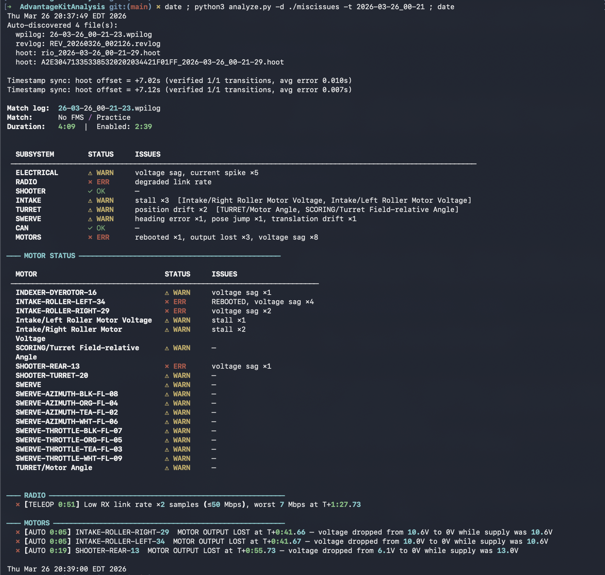
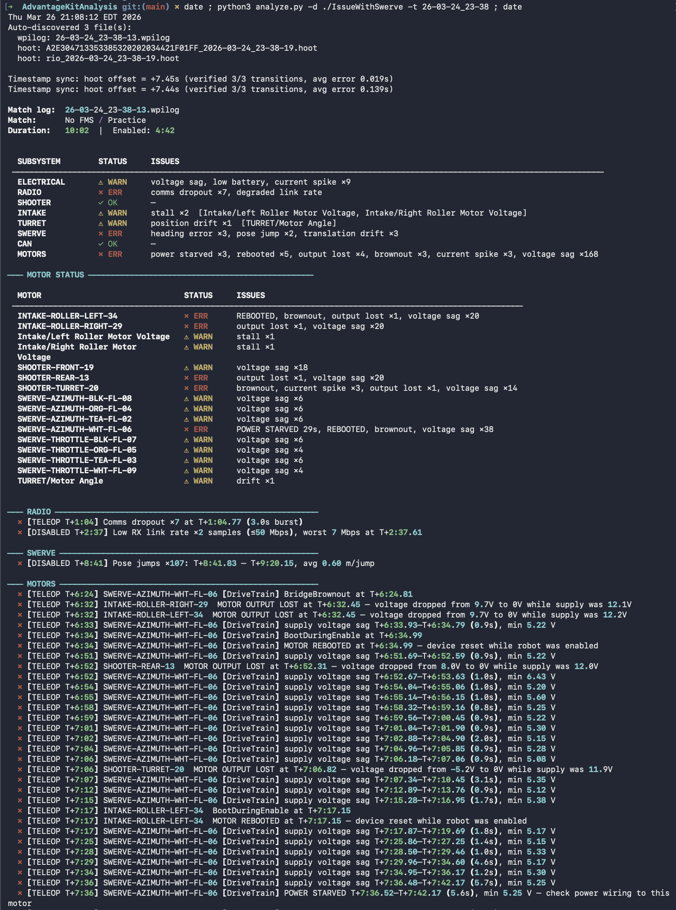

# FRC Robot Log Analyzer



This is 95% vibe coded, 5% hand coded, as a proof of concept for cross-referencing FRC robot logs and checking for errors. It is based upon 8592's 2026 robot, which has a swerve, intake, dye rotor, feeder wheels, turret, fly wheel, rear flywheels, and some misc things. Don't squint too hard at the code - a lot of it is hard coded and specific to our bot.

Ideally, from this, the community can create a 'spec', 'list of features', etc for what a really good and generic log analyzer looks like. We can then take bits of code from this project to make a proper universal tool.

Command-line tool for analyzing FRC robot log files. Parses AdvantageKit `.wpilog`, REV Robotics `.revlog`, and CTRE Phoenix 6 `.hoot` files to surface electrical, mechanical, and motor controller issues.

## Supported File Formats

| Format | Source | Parser |
|---|---|---|
| `.wpilog` | AdvantageKit / WPILib DataLog | Native Python (`parser.py`) |
| `.revlog` | REV Robotics StatusLogger (SPARK MAX/FLEX) | Native Python (`revlog_parser.py`) |
| `.hoot` | CTRE Phoenix 6 Signal Logger (TalonFX, CANcoder, Pigeon2) | Via `owlet` CLI (`hoot_converter.py`) |

## Timestamps and Game Mode

### Timestamp sources

Each log format uses a different clock:

| Format | Clock source | Epoch |
|---|---|---|
| `.wpilog` | roboRIO FPGA clock | Relative to robot boot (starts ~1.7s) |
| `.revlog` | CAN RX timestamp (milliseconds) | Relative to REVLib StatusLogger start |
| `.hoot` | Unix epoch (microseconds) | Converted to session-relative, then synced to wpilog |

### Automatic timestamp synchronization (hoot ↔ wpilog)

When both `.hoot` and `.wpilog` files are analyzed together, the analyzer automatically synchronizes their timestamps using the `RobotEnable` signal logged by CTRE TalonFX devices.

The sync process:
1. Finds enable/disable transitions in the wpilog (`DriverStation/Enabled`)
2. Finds `RobotEnable` transitions in the hoot data (logged by the TalonFX itself)
3. Matches the first enable transition after a long disabled period in both sources
4. Computes a time offset from that pair
5. Verifies the offset against subsequent transitions — all must match within 1 second
6. If verified, applies the offset to all hoot timestamps

The sync status is printed to stderr on each run, e.g.:
```
Timestamp sync: hoot offset = +7.45s (verified 3/3 transitions, avg error 0.019s)
```

If sync fails (no `RobotEnable` data, or transitions don't match), hoot timestamps remain session-relative and a warning is printed.

### Unsynchronized sources

`.revlog` timestamps are not currently synced. The REV StatusLogger uses CAN RX timestamps which are typically close to the FPGA clock, so `.revlog` and `.wpilog` timestamps may already be approximately aligned — but this is not guaranteed and no automatic correction is applied.

### Game mode detection

Game mode (`DISABLED`, `AUTO`, `TELEOP`) is determined **only from the `.wpilog` file**, using two DriverStation channels:

- `/DriverStation/Enabled` (boolean) — whether the robot is enabled
- `/DriverStation/Autonomous` (boolean) — whether autonomous mode is active

The mode at any point in time is:
- **DISABLED** — `Enabled = False`
- **AUTO** — `Enabled = True` and `Autonomous = True`
- **TELEOP** — `Enabled = True` and `Autonomous = False`

### Match time vs session time

The analyzer distinguishes between FMS matches and practice sessions:

- **FMS match** — the first enabled mode is AUTO (standard sequence: DISABLED → AUTO → DISABLED → TELEOP → DISABLED). Issue timestamps show match-relative time: `[AUTO 0:12]`, `[TELEOP 2:30]`.
- **Practice session** — the first enabled mode is TELEOP. Issue timestamps show session-relative time: `[TELEOP T+0:40]`, `[DISABLED T+2:30]`.

When `.revlog` or `.hoot` data is analyzed alongside a `.wpilog`, the game mode prefix on each issue is determined by looking up that issue's timestamp in the wpilog's game mode timeline. If no `.wpilog` is provided, issues from `.revlog` and `.hoot` files are reported without a game mode prefix.

## Dependencies

- **Python 3.10+**
- **rich** >= 13.0 — colored terminal output (optional; falls back to plain ANSI)
- **numpy** >= 1.24 — signal processing acceleration (optional; pure-Python fallback)

For `.hoot` file support, CTRE's `owlet` binary is required. It is downloaded automatically on first use from `redist.ctr-electronics.com` and cached in `tools/`.

## Installation

```bash
pip install rich numpy
```

Or with the included requirements file:

```bash
pip install -r requirements.txt
```

Both dependencies are optional. The tool runs with no external packages installed.

## Configuration

### `can_map.json` (optional)

Place a `can_map.json` file in the project root to configure device labels, subsystem assignments, motor groups, and swerve drive analysis. The file supports two formats that can be mixed in the same file.

#### Simple format

Flat key-value pairs for device labeling only:

```json
{
  "PDH:0":  "Front Left Drive",
  "PDH:4":  "Intake Motor",
  "SPARK:16": "FL Drive SPARK",
  "CTRE:TalonFX-2": "FL Drive Falcon"
}
```

#### Extended format

Adds subsystem routing, motor group comparison, and swerve configuration:

```json
{
  "swerve": {
    "max_rotation": "180 deg/s",
    "translate_input": {"controller": 0, "x_axis": 0, "y_axis": 1},
    "rotate_input":    {"controller": 0, "axis": 4}
  },

  "subsystems": ["ELEVATOR", "SWERVE", "INTAKE"],

  "devices": {
    "CTRE:TalonFX-29": { "name": "Elevator Left",   "subsystem": "ELEVATOR", "control_mode": "position" },
    "CTRE:TalonFX-34": { "name": "Elevator Right",  "subsystem": "ELEVATOR", "control_mode": "position" },
    "CTRE:TalonFX-2":  { "name": "FL Drive Falcon",  "subsystem": "SWERVE",  "control_mode": "velocity" },
    "CTRE:TalonFX-3":  { "name": "FL Steer Falcon",  "subsystem": "SWERVE",  "control_mode": "position" },
    "SPARK:16":         { "name": "Indexer",           "subsystem": "INTAKE" },
    "CTRE:Pigeon2-30":  { "name": "IMU",              "subsystem": "SWERVE" },
    "PDH:0":            { "name": "FL Drive",          "subsystem": "SWERVE" }
  },

  "motor_groups": [
    {
      "name": "Elevator",
      "subsystem": "ELEVATOR",
      "motors": ["CTRE:TalonFX-29", "CTRE:TalonFX-34"],
      "relationship": "same_direction",
      "ratio": 1.0
    },
    {
      "name": "Intake Rollers",
      "subsystem": "INTAKE",
      "motors": ["SPARK:16", "SPARK:31"],
      "relationship": "opposite_direction",
      "ratio": 1.0
    }
  ]
}
```

**`swerve`** — Configures swerve drive yaw analysis. Required for `LAG_IN_COMMANDED_YAW` and `UNCOMMANDED_YAW` detection (see [Swerve Yaw Analysis](#swerve-yaw-analysis)). Fields:

| Field | Description |
|---|---|
| `max_rotation` | Maximum swerve rotation rate. Accepts a number (deg/s) or a string with units: `"180 deg/s"`, `"3.14 rad/s"`. Used to compute expected yaw rate from stick deflection. Defaults to 360 deg/s if omitted. |
| `translate_input` | Identifies the driver's translation joystick: `{"controller": N, "x_axis": N, "y_axis": N}`. `controller` is the DriverStation slot (0-5), axes are zero-based indices on that controller. |
| `rotate_input` | Identifies the driver's rotation joystick: `{"controller": N, "axis": N}`. May reference a different controller than `translate_input`. |

Translation and rotation inputs can be on the same controller (e.g., left stick for translation, right stick X for rotation) or on different controllers entirely. Without `rotate_input`, yaw analysis is skipped — there is no way to infer driver intent without knowing which stick controls rotation.

**`subsystems`** — Declares subsystem names that should appear in the report table. These are merged with the defaults (`ELECTRICAL`, `RADIO`, `SHOOTER`, `INTAKE`, `TURRET`, `SWERVE`, `CAN`, `MOTORS`). Without this, CTRE and REV device issues all land under `MOTORS` since those log formats have no concept of which subsystem a motor belongs to.

**`devices`** — Maps device keys to a name, subsystem, and optional control mode. When a device has a subsystem assignment, all issues from that device (faults, voltage sags, current spikes, etc.) appear under that subsystem instead of the generic `HOOT`/`REVLOG`.

The optional `control_mode` field affects position following error checks for CTRE TalonFX devices:

| Control mode | Behavior |
|---|---|
| `"position"` | Position following error checks are enabled |
| `"velocity"` | Position following error checks are skipped |
| `"motion_profile"` | Position following error checks are enabled |
| _(omitted)_ | Position following error checks are skipped (conservative default) |

**`motor_groups`** — Defines mechanically linked motors for comparison analysis. The analyzer detects:
- **Output divergence** (ERR): one motor driving while the other is off
- **Velocity divergence** (WARN): motors running at different speeds (> 20% difference)
- **Current imbalance** (WARN): one motor drawing > 1.5x the other's current

Motor group fields:
| Field | Description |
|---|---|
| `name` | Group label shown in issue messages |
| `subsystem` | Subsystem to route group issues to |
| `motors` | List of device keys (minimum 2) |
| `relationship` | `same_direction` (default) or `opposite_direction` |
| `ratio` | Gear ratio between motors (default 1.0) |

**Device key formats:**

| Key pattern | Devices |
|---|---|
| `CTRE:<DeviceType-ID>` | CTRE Phoenix 6 devices (e.g., `CTRE:TalonFX-2`, `CTRE:CANcoder-12`, `CTRE:Pigeon2-30`) |
| `SPARK:<device_num>` | REV SPARK MAX/FLEX by CAN ID (e.g., `SPARK:16`) |
| `PDH:<channel>` | PDH current channels 0-23 (e.g., `PDH:0`) |
| `SUBSYSTEM/Motor` | AdvantageKit motor paths (e.g., `SHOOTER/Flywheel`) |

### Analyzer thresholds

Thresholds are defined as constants at the top of each analyzer module:

**Electrical / Motor power:**

| File | Threshold | Default |
|---|---|---|
| `analyzers/electrical.py` | Brownout | `SystemStats/BrownedOut = true` |
| `analyzers/electrical.py` | Low battery voltage | < 11.0 V for > 1 s |
| `analyzers/electrical.py` | Voltage sag detection | 2.0 V drop in 0.5 s |
| `analyzers/electrical.py` | Sustained current spike | > 40 A for > 0.5 s |
| `analyzers/electrical.py` | Instantaneous current spike | > 60 A |
| `analyzers/electrical.py` | Voltage rail fault | 3v3/5v/6v rail fault count > 0 |
| `analyzers/revlog.py` | Motor over-temperature | > 80 C for > 2 s |
| `analyzers/revlog.py` | Motor stall | output > 0.3 and velocity < 50 RPM for > 0.5 s |
| `analyzers/revlog.py` | Power starved (per motor) | < 7.0 V for > 5 s |
| `analyzers/revlog.py` | Bus voltage sag (per motor) | < 10.0 V for > 0.5 s |
| `analyzers/revlog.py` | HasReset mid-session | Motor rebooted during session |
| `analyzers/hoot.py` | TalonFX over-temperature | > 80 C for > 2 s |
| `analyzers/hoot.py` | Power starved (per device) | < 7.0 V for > 5 s |
| `analyzers/hoot.py` | Supply voltage sag (per device) | < 10.0 V for > 0.5 s |
| `analyzers/hoot.py` | Stator current spike | > 80 A for > 0.5 s |
| `analyzers/hoot.py` | Motor output lost | > 5V to 0V, stays at 0 for 5+ samples |
| `analyzers/hoot.py` | Motor rebooted while enabled | `Fault_BootDuringEnable` active while enabled |
| `analyzers/hoot.py` | Duty cycle saturated | abs(duty cycle) > 0.98 for > 1 s |
| `analyzers/hoot.py` | Position following error | > 0.5 rotations for > 0.5 s (position/motion-profile modes only) |
| `analyzers/hoot.py` | Static brake disabled | `Fault_StaticBrakeDisabled` active |
| `analyzers/hoot.py` | Stator/supply current limiting | `Fault_StatorCurrLimit` or `Fault_SupplyCurrLimit` active while enabled |

**System / roboRIO:**

| File | Check | ERR | WARN |
|---|---|---|---|
| `analyzers/system.py` | CAN bus utilization | > 75% for > 1 s | 60–75% for > 1 s |
| `analyzers/system.py` | roboRIO CPU temperature | > 75 C for > 5 s | 65–75 C for > 5 s |
| `analyzers/system.py` | Loop overrun (full cycle) | > 100 ms for > 1 s | 40–100 ms for > 1 s |
| `analyzers/system.py` | GC pause | > 50 ms | ≥ 3 pauses > 20 ms |

**Radio / Communications:**

| File | Check | ERR | WARN | INFO |
|---|---|---|---|---|
| `analyzers/radio.py` | Signal strength (dBm) | ≤ -70 | -60 to -70 | -50 to -60 |
| `analyzers/radio.py` | Signal-to-noise ratio (dB) | ≤ 20 | 20–30 | — |
| `analyzers/radio.py` | Link rate RX/TX (Mbps) | ≤ 50 | 50–200 | — |
| `analyzers/radio.py` | Connection quality | — | below "good" | — |
| `analyzers/radio.py` | Comms dropout burst | ≥ 5 events | 2–4 events | 1 event |
| `analyzers/radio.py` | Radio disconnect | while enabled | while disabled | — |

**Mechanical / Swerve:**

| File | Check | Threshold |
|---|---|---|
| `analyzers/mechanical.py` | Shooter velocity error | > 200 RPM error for > 0.5 s |
| `analyzers/mechanical.py` | Intake motor stall | Voltage > 4V, rotation ≈ 0 for > 0.5 s |
| `analyzers/mechanical.py` | Intake roller imbalance | Left/right voltage diff > 3V for > 1 s |
| `analyzers/mechanical.py` | Turret position drift | > 5°/s drift with voltage ≈ 0 for > 1 s |
| `analyzers/mechanical.py` | Indexer jam/stall | Commanded > 100 RPM, actual < 20 RPM for > 0.5 s |
| `analyzers/mechanical.py` | Shooter active while off-target | Shooter > 500 RPM with tracking = false for > 0.3 s |
| `analyzers/mechanical.py` | Swerve heading error | driveRotate vs TargetSpeeds.omega > 10°/s for > 0.5 s |
| `analyzers/mechanical.py` | Swerve pose jump | Jump > 0.3 m in < 0.1 s |
| `analyzers/mechanical.py` | Swerve translation drift | TranslateX/Y vs commanded > 0.3 m/s for > 0.5 s |
| `analyzers/mechanical.py` | Vision dropout | Gap > 3 s in VisionPose data (ERR), > 1 s (WARN) |
| `analyzers/mechanical.py` | Vision high ambiguity | Ambiguity ratio > 0.15 for > 0.5 s |

**Pigeon2 IMU** (from `.hoot` files):

| Check | ERR | WARN |
|---|---|---|
| Collision / impact | Lateral acceleration > 2.0 g | > 1.5 g |
| Pitch tilt | > 15° for > 0.5 s | 10–15° for > 0.5 s |
| Roll tilt | > 15° for > 0.5 s | 10–15° for > 0.5 s |
| Gyro drift while stationary | — | > 0.5°/s with NoMotionCount > 0 for > 3 s |
| Over-temperature | — | > 50 C for > 5 s |
| Magnetometer interference | — | > 100 µT for > 1 s |
| Sensor saturation | — | Accelerometer, gyroscope, or magnetometer saturated |

**CANcoder** (from `.hoot` files):

| Check | Severity |
|---|---|
| Bad magnet health | ERR |
| Hardware fault | ERR |

### Swerve yaw analysis

When `swerve.rotate_input` is configured in `can_map.json`, the analyzer compares the driver's raw joystick inputs against the robot's actual rotation (derived from `SWERVE/Current Pose`) to detect two classes of drivetrain issues:

**LAG_IN_COMMANDED_YAW** — The driver is pushing the rotation stick but the robot isn't turning proportionally.

- Computes expected yaw rate as `|stick_deflection| * max_rotation`
- Compares against actual yaw rate from pose differentiation
- Flags when actual < 35% of expected, sustained for > 0.75 s
- Severity: ERR if total lag > 2 s, WARN otherwise
- Possible causes: CG imbalance, pinned by another robot, rotating against a wall, drivetrain binding

**UNCOMMANDED_YAW** — The robot is rotating when the driver's rotation stick is in the deadband.

- Checks the raw rotation axis is below deadband (< 0.10) with no recent input (< 0.15 in preceding 0.3 s)
- Flags when actual yaw rate > 15°/s, sustained for > 0.5 s
- Severity: ERR if total duration > 2 s, WARN otherwise
- Possible causes: swerve module steering offset error, unequal drive motor output, wheel scrub

Both detections filter out **impacts** to avoid false positives:
- **Primary** (when `.hoot` Pigeon2 data is available): lateral acceleration from `AccelerationX/Y` > 1.5 g suppresses a 0.5 s window
- **Fallback** (wpilog only): angular acceleration from pose > 50 rad/s² suppresses a 0.5 s window

Issue messages include the raw joystick values at the worst moment so teams can verify driver intent:

```
LAG_IN_COMMANDED_YAW: T+2:16 – T+2:23, 6.8s, worst 23% of commanded,
  translate=[-0.78, +0.64], rotate=[+0.40], [max 180°/s — configured]

UNCOMMANDED_YAW: T+1:25 – T+1:43, 3 spans / 16.3s total, peak 29°/s,
  while translating (stick 0.80), translate=[-0.12, +0.79], rotate=[+0.00]
```

### Voltage sag severity levels

Voltage sags are classified into three severity tiers across all analyzers:

| Level | Voltage | Detail flag needed |
|---|---|---|
| `ERR` | < 7.0 V | shown by default |
| `WARN` | 7.0 – 9.0 V | `--warn` |
| `INFO` | 9.0 – 10.0 V | `--info` |

### Detail output levels

The detailed issue listing defaults to showing only errors. Use `--warn` or `--info` to include lower-severity issues:

```bash
# Default: only ERR-level issues in detail sections
python3 analyze.py -d logs/ -t 2026-03-24_23-38

# Include warnings
python3 analyze.py -d logs/ -t 2026-03-24_23-38 --warn

# Include everything (info, warnings, errors)
python3 analyze.py -d logs/ -t 2026-03-24_23-38 --info
```

The summary table and motor status table always show all subsystems regardless of detail level — only the per-subsystem detail sections are filtered.

## Usage

There are two ways to specify which log files to analyze: **auto-discovery by timestamp** or **explicit file paths**. Both can be combined with filtering and verbose options.

### Auto-discovery by timestamp (recommended)

Point the analyzer at a root directory and provide a timestamp. It searches recursively through all subdirectories and finds matching `.wpilog`, `.revlog`, and `.hoot` files automatically:

```bash
python3 analyze.py --dir IssueWithSwerve/ --time 2026-03-24_23-38
```

Files do **not** need to be in the same folder. Different FRC vendors place logs in their own directory structures — the search walks the entire directory tree, so you can point `--dir` at a top-level logs directory or even a USB drive root:

```bash
# Search an entire USB drive for logs from a specific match
python3 analyze.py -d /media/usb/ -t 2026-03-24_23-38

# Search the roboRIO log root
python3 analyze.py -d /home/lvuser/logs/ -t 2026-03-24_23-38
```

The timestamp is a prefix match — you can be as specific or as broad as needed:

```bash
# Match all files from a specific second
python3 analyze.py -d logs/ -t 2026-03-24_23-38-19

# Match all files from a specific minute
python3 analyze.py -d logs/ -t 2026-03-24_23-38

# Match all files from a specific date
python3 analyze.py -d logs/ -t 2026-03-24
```

The discovery logic handles the different filename conventions used by each vendor:
- `.wpilog` — `YY-MM-DD_HH-MM-SS.wpilog` (e.g., `26-03-24_23-38-13.wpilog`)
- `.revlog` — `REV_YYYYMMDD_HHMMSS.revlog` (e.g., `REV_20260324_233816.revlog`)
- `.hoot` — `*_YYYY-MM-DD_HH-MM-SS.hoot` (e.g., `rio_2026-03-24_23-38-19.hoot`)

### Auto-discovery by match ID

If you have `.hoot` files with FMS match IDs in their filenames (e.g., `VAALE1_Q32_rio_2025-09-27_14-08-53.hoot`), you can discover all logs for a match by its ID:

```bash
# Find all logs for qualification match 32
python3 analyze.py --dir logs/ --match Q32

# Full event-qualified match ID
python3 analyze.py -d logs/ -m VAALE1_Q32
```

The match ID is matched as a delimited component in `.hoot` filenames. Once hoot files are found, their timestamp is used to discover matching `.wpilog` and `.revlog` files.

### Explicit file paths

Specify any combination of individual log files directly:

```bash
# WPILog only
python3 analyze.py path/to/logfile.wpilog

# WPILog + REV motor data
python3 analyze.py logfile.wpilog --revlog file.revlog

# WPILog + CTRE hoot logs (multiple hoot files supported)
python3 analyze.py logfile.wpilog --hoot canivore.hoot rio.hoot

# All three sources
python3 analyze.py logfile.wpilog \
    --revlog file.revlog \
    --hoot canivore.hoot rio.hoot

# REV log only (no wpilog required)
python3 analyze.py --revlog file.revlog

# Hoot files only
python3 analyze.py --hoot canivore.hoot rio.hoot
```

### Options

```
-d, --dir DIR          Directory for auto-discovery (use with --time or --match)
-t, --time TIMESTAMP   Timestamp prefix for auto-discovery
-m, --match ID         FMS match identifier for auto-discovery (e.g., Q32, VAALE1_Q32)
-r, --revlog FILE      Path to .revlog file
    --hoot FILE [FILE]  Path to one or more .hoot files
-s, --subsystem NAME   Filter output to one subsystem
-w, --warn             Show warnings and errors in detail sections
-i, --info             Show all issues (info, warnings, errors) in detail sections
-v, --verbose          Show all decoded channels
-b, --batch DIR        Batch-analyze all .wpilog files in a directory
    --clean            Remove temporary files (*_converted.wpilog) after analysis
```

### Filter to one subsystem

```bash
python3 analyze.py -d logs/ -t 2026-03-24_23-38 -s HOOT
```

Available subsystems: `ELECTRICAL`, `RADIO`, `SHOOTER`, `INTAKE`, `TURRET`, `SWERVE`, `CAN`, `MOTORS` (plus any user-defined subsystems from `can_map.json`)

### Show all decoded channels

```bash
python3 analyze.py -d logs/ -t 2026-03-24_23-38 --verbose
```

### Batch mode

Analyze all `.wpilog` files in a directory and print a one-line summary for each:

```bash
python3 analyze.py --batch path/to/logs/
```

### Cleanup temporary files

When `.hoot` files are analyzed, they are converted to `.wpilog` via CTRE's `owlet` tool and cached alongside the originals. Use `--clean` to remove these after analysis:

```bash
python3 analyze.py -d logs/ -t 2026-03-24_23-38 --clean
```
# Sample log outputs
## Swerve azimuth motor power wire came loose
